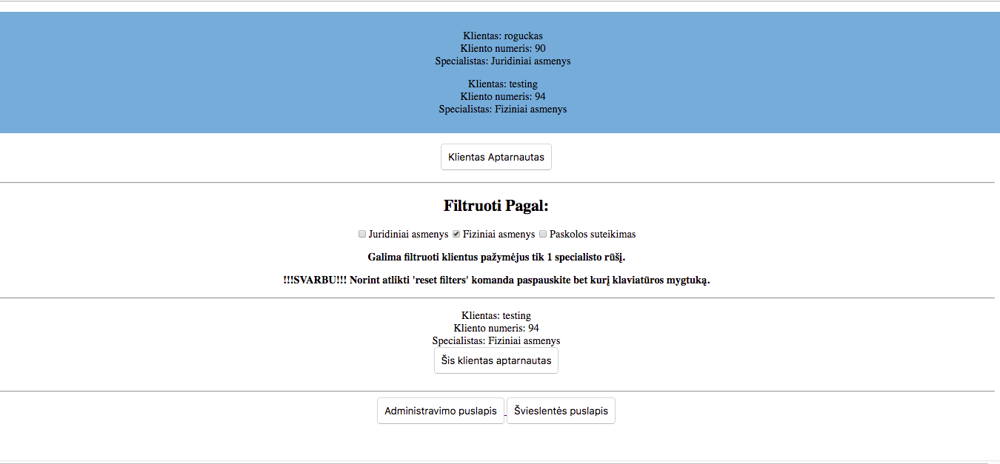
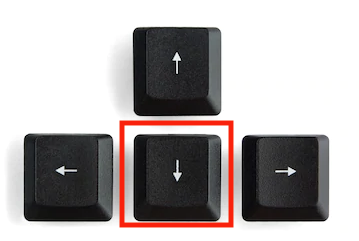

# NFQ Academy Task

# Project Overview
Ligoninėse, bankuose, pašte, pasų išdavimo skyriuose ir pan. galima matyti ekranus su skaičiukais. 
Ateini, gauni lapuką pas pasirinktą specialistą/darbuotoją/langelį ir lauki savo eilės.

Ar kada pagalvojote, kaip būtų faina, jei žinotumėte kiek maždaug dar reikia laukti eilėje ir atitinkamai susiplanuoti savo darbus.

# Operating instructions
<h1>LEVEL 1</h1>
<h2>Kaip veikia sistema su <i>'naudotojas-specialistas'</i> įvestais duomenimis <b>(step-by-step)</b> ?</h2>

1. Naršyklėje matomas <b>"Administratoriaus puslapis"</b>.
2. Šiame puslapyje <i>'naudotojas-specialistas'</i> turi galimybę pridėti klientą(-us) į laukimo sąrašą (eilę)
    * 2.1 <b>SVARBU!!!</b> Norint pridėti daugiau nei 1 klientą į <b>"Švieslentės puslapis"</b> Įvedus kliento duomenis ir paspaudus <b>"Išsaugoti klientą"</b> (pamatysite ekrane žinutę, patvirtinančią klineto išsaugojimą)
    Tada galite įvesti kito kliento duomenis ir vėl spausti mygtuką <b>"Išsaugoti klientą"</b>. 

3. Suformuotą klientų sąrašą <i>'naudotojas-specialistas'</i> gali pamatyti paspaudęs mygtuką <b>"Klientų sąrašas"</b>
 <b>"Švieslentės puslapis"</b> matomas sąrašas (eilė) klientų, kurie buvo pridėti <b>"Administratoriaus puslapis"</b> lange.
    * 3.1 <b>SVARBU!!!</b> Esant <b>"Švieslentės puslapis"</b> lange paspaudus mygtuką <b>"Administratoriaus puslapis"</b> <i>'naudotojas-specialistas'</i> yra sugrąžinamas į pradinį puslapį (<b>"Administratoriaus puslapis"</b>)
    Visi prieš tai įvesti duomenys yra ištrinami.
4.  Paspaudus mygtuką <b>"Specialisto puslapis"</b> <i>'naudotojas-specialistas'</i> nuvedamas į <b>"Specialisto puslapis"</b> langą.
Šiame lange <i>'naudotojas-specialistas'</i> mato visus klientus, kurie lauke eilėje.
5. Paspaudus mygtuką <b>"Klientas Aptarnautas"</b> iš klientų sąrašo yra pašalinamas pirmas sąraše esanti klientas.
6. Žemiau esančioje dalyje <b>"Filtruoti Pagal:"</b> <i>'naudotojas-specialistas'</i> gali atlikti klientų filtravimo funkciją.
    Pasirinkus vieną iš specialistų atliekamas filtravimas ir parodomi klientai, kurie atitiko filtravimo kriterijus (žr.nuotrauką)
    
7. Norint atlikti <b>"reset filter" komandą paspauskite "Arrow down" kliaviatūros mygtuką</b>
    
8. Paspaudus mygtuką <b>"Administravimo puslapis"</b> <i>'naudotojas-specialistas'</i> nuvedamas į pradinį puslapį ir yra įvykdomas 3.1 punktas.
9. Paspaudus mugtyką <b>"Švieslentės puslapis"</b> <i>'naudotojas-specialistas'</i> nuvedamas į <b>"Švieslentės puslapis"</b> langą.
    * 9.1 SVARBU!!! Jeigu <b>"Specialisto puslapis"</b> lange buvo atlikta <b>"Klientas Aptarnautas"</b> komanda, tai <b>"Švieslentės puslapis"</b> bus matomas atnaujintas klientų sąrašas (eilė)

<h2>Kaip veikia sistema su <i>'pavyzdiniais duomenis'</i> <b>(step-by-step)</b> ?</h2>
10. Naršyklėje matomas <b>"Administratoriaus puslapis"</b>. 
11. Šiame puslapyje <i>'naudotojas-specialistas'</i> turi galimybę pridėti "pavyzdinius duomenis" į klientų sąrašą.
Funkciją galima atlikti paspaudus mygtuką <b>"Įkelti pavyzdinius klientus"</b>.
    * 11.1 Paspaudus mygtuką "pavyzdiniai duomenys" yra išsaugojami į <i>'localSotrage'</i> pridėti klientą(-us) į laukimo sąrašą (eilę) 
12. Suformuotą klientų sąrašą <i>'naudotojas-specialistas'</i> gali pamatyti paspaudęs mygtuką <b>"Klientų sąrašas"</b>
    * 12.1 <b>SVARBU!!!</b> Esant <b>"Švieslentės puslapis"</b> lange paspaudus mygtuką <b>"Administratoriaus puslapis"</b> <i>'naudotojas-specialistas'</i> yra sugrąžinamas į pradinį puslapį (<b>"Administratoriaus puslapis"</b>)
        Visi prieš tai išsaugoti duomenys išlieka, tai suteikia galimybę pridėti pridėti daugiau klientų į sąrašą, juos įvedant "ranka".
    * 12.2 <b>SVARBU!!!</b> Sugrįžus iš <b>"Švieslentės puslapis"</b> į <b>"Administratoriaus puslapis"</b> <i>'naudotojas-specialistas'</i> pakartotinai paspaudęs mygtuką <b>"Įkelti pavyzdinius klientus"</b> per naują nustato <i>'localStorage'</i> talpykloje išsaugotus duomenis.
        Visi prieš tai išsaugoti duomenys išlieka dingsta. Programa toliau veikia nuo 1. punkto. 
* <b>!!! 4 - 7 etapai identiški ankščiau minėtiems!!!</b> 
13. Paspaudus mygtuką <b>"Administravimo puslapis"</b> <i>'naudotojas-specialistas'</i> nuvedamas į pradinį puslapį ir yra įvykdomas 3.1 punktas. 
14. Paspaudus mugtyką <b>"Švieslentės puslapis"</b> <i>'naudotojas-specialistas'</i> nuvedamas į <b>"Švieslentės puslapis"</b> langą.
    * 14.1 SVARBU!!! Jeigu <b>"Specialisto puslapis"</b> lange buvo atlikta <b>"Klientas Aptarnautas"</b> komanda, tai <b>"Švieslentės puslapis"</b> bus matomas atnaujintas klientų sąrašas (eilė)
